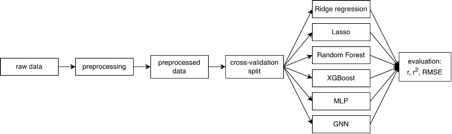

Meeting Notes – 9th July 2026
Workflow
•	run preprocessing script "preprocessing.py" -> normalises + log transforms data, applied feature reduction via highly variable gene selection 
•	output preprocessed data for models: rna_hvg.h5ad, protein_data.hvg, rna_data.hvg 
•	run model with spatially-aware cross-validation split: load this using the "cross_validation.py" file and the "cv_split.json" file 
•	evaluate model using pearson r, r2, and RMSE 
•	upload results and model on github 

Models
•	Ridge regression 
•	Lasso – Pallavi 
•	Random Forest – Shreya 
•	XGBoost – Emily 
•	MLP – Priya 
•	GNN – Vaishnavi 

Next steps:
•	Upload any results and models to GitHub 
•	Document model + parameter choices and upload to GitHub 
•	AWS access  
